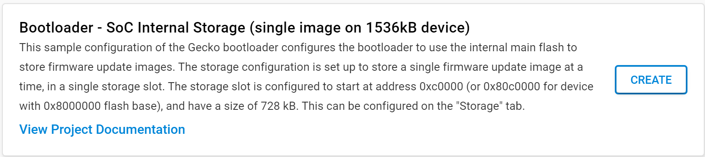

# Building a Radio Co-Processor for OpenThread Border Router using a Silicon Labs Matter / Thread Development Board
### Author: [Olav Tollefsen](https://www.linkedin.com/in/olavtollefsen/)

## Introduction

This article shows how to build an OpenThread Border Router using a Raspberry Pi and a Silicon Labs Matter / Thread Development Board

This article is based on Silicon Labs Gecko SDK version 4.4.0

### What you will need

- A PC running Windows as the development workstation.
- Install Simplicity Studio V5 from Silicon Labs.
- Silicon Labs xG24-DK2601B EFR32xG24 Dev Kit (or similar supported board).

## Concepts and overall scenario

The OpenThread Border Router concepts and overall scenario are described here:

https://openthread.io/guides/border-router

## Prepare the Silicon Labs Dev Kit to run the Radio Co-Processor (RCP) application

Connect your Silicon Labs Dev Kit to your PC using an USB cable and run Simplicity Studio.

### Prepare the Bootloader

Find the "Bootloader - SoC Internal Storage (single image on 1536kB device)" example project and create a new project from it. This bootloader is for the Silicon Labs xG24-DK2601B EFR32xG24 Dev Kit, which has 1536kB Flash.

Build the bootloader project, find the .s37 image file and flash it to your Silicon Labs Dev Kit.

### Prepare the OpenThread RCP application

Find the "OpenThread - RCP" example project and create a new project from it. 

Build the project, find the .s37 image file and flash it to your Silicon Labs Dev Kit.
